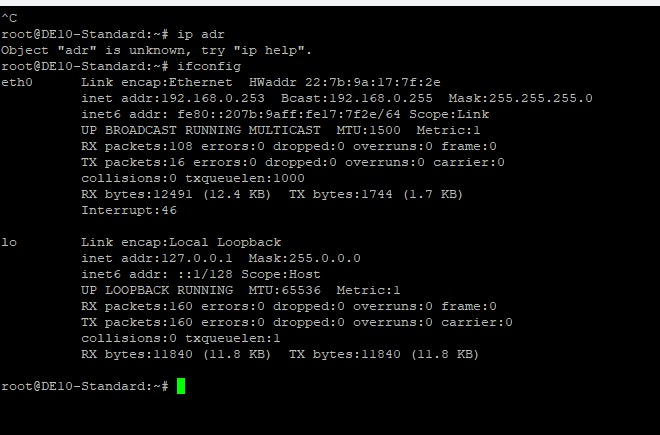
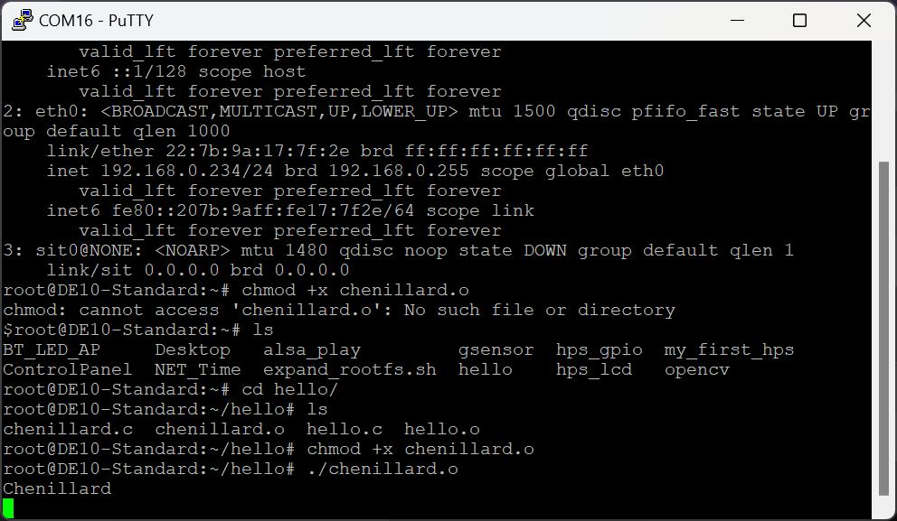
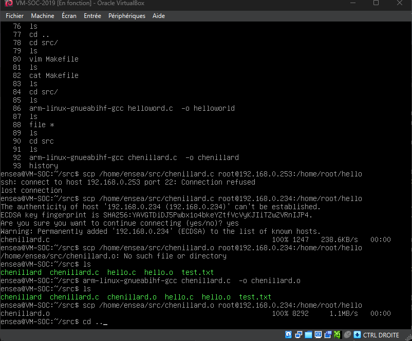
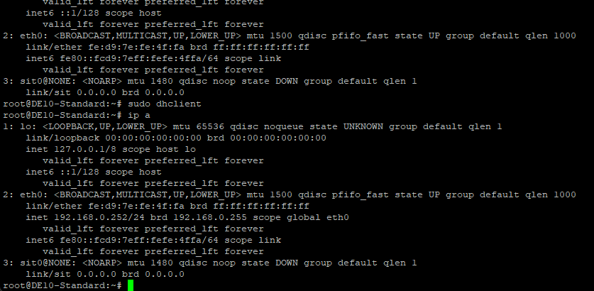
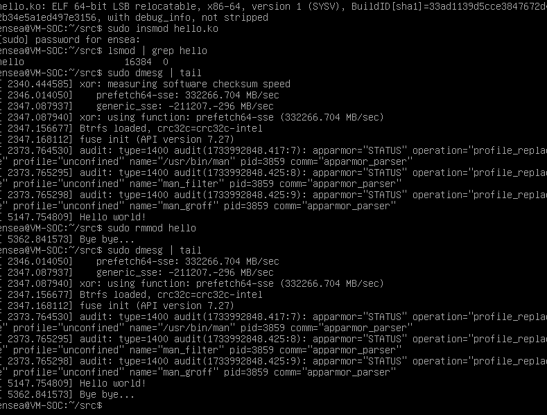
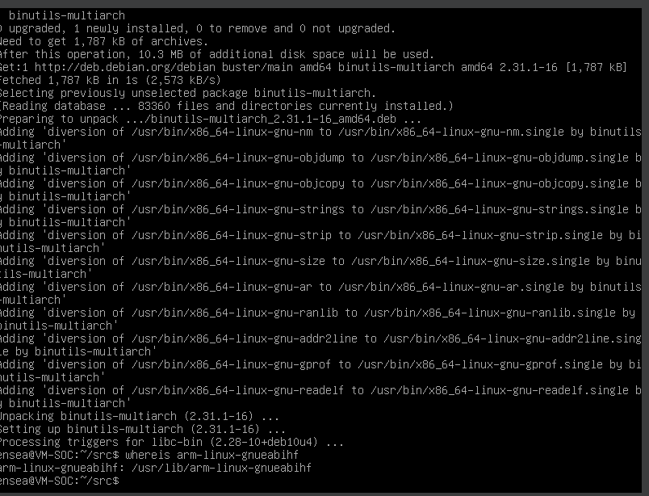
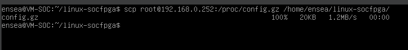

# 2425_linuxemb
vincent lkme


### 1.**Prise en main**

#### 1.1. **Préparation de la carte SD**

A l'aide de l'outil Win32DiskImager on flashe la carte sd pour y mettre 

#### 1.2. **Démarrage**

#### 1.3. **Connexion au système**

##### 1.3.1. **Liaison série**

le port utilisé trouvé étaut com16. On règle la vitesse 115200.

on peut lancer minicom avec cette commande

```bash
minicom -D /dev/ttyACM0 -b 115200
```

ou bien 

```bash
minicom -D /dev/ttyUSB0 -b 115200
```

on peut appuyer deux fois sur entrée si le terminal ne s'affiche pas 


credentials :

login : root

mdp : aucun n'appuyer que sur entrée


On reboot et on observe la taille occupée par l'image

```bash
df -h
```


 On essaie d'occuper tout l'espace disponible en lançant un script `./expand_rootfs.sh`

On reboot et on lance le script `./resize2fs_once`

##### 1.3.3. **Configuration réseau**

On rajoute dans le fichier interfaces la configuration suivante : 

```bash
auto eth0
iface eth0 inet dhcp
allow-hotplug eth0
```

On reboot. 
On lit la configuration prise par l'interface réseau avec la commande `ip a`dr ou `ifconfig`



Pour forcer la machine a reprendre une ipv4 par le dhc on utilise la commande suivante, on a récuéré l'ip 192.168..252 lors de la deuxième séance.

```bash
sudo dhclient 
```

Le ping dans les 2 sens fonctionne entre notre machine de dévellopement qui est sur le réseau Think
dont le ssid est : 


On va activer le ssh afin de pouvoir se passer de la liaison série. Pour cela on ajoute dans le fichier `/etc/ssh/sshd_config` la ligne suivante

```bash
PermitEmptyPasswords yes
```


en ssh dans putty ou dans un terminal linux on se connecte en ssh avec 

```
ssh root@192.168.0.
```


ou si l'adresse ip de la carte a cahngé pour quelque raisons que ce soit par exemple, on a pu essayer avec cette autre adresse ip

```bash
ssh root@192.168.0.
```


#### 1.4. **Découverte de la cible**

##### 1.4.1. **Exploration des dossiers /sys/class et /proc**

O explore les répertoires de la carte, on peut lire ce qu'ils contiennent dans les captures suivantes :

—/proc : cpuinfo, ioports, iomem

— /sys/class/leds/fpga_ledX/
— /proc/ioport
— /proc/iomem
— /proc/device-tree/sopc@0 à comparer avec le fichier iomem.

##### 1.4.2. **Compilation croisée**

On utilise la VM prévue à cet effet, avec un dossier partagé, pour compiler nos fichier sources à l'aide du compilateur arm-linux-gnueabihf-gcc. 

##### 1.4.3. **Hello world !**


On test la cross-compilation avec un fichier qui doit afficher hello world! lorsque l'on lance le programme 

fichier hello.c 

```c
#include <stdio.h>

int main() {
    printf("Hello World!\n");
    return 0;
}
```

La commande pour compiler est la suivante 

```bash
arm-linux-gnueabihf-gcc hello.c -o hello.o
```

On téléverse sur la carte SOC par le réseau le fichier .o avec la commande 

```bash
scp /home/ensea/src/hello.c root@IP_DE_LA_CARTE_SOC:/home/root/hello
```

Le téléchargement se lit en bas de la capture suivante


On rend exécutable ce fichier avec la commande  

```bash
chmod +x hello.o
```

Et on lance le programme avec `./hello`

On peut voir le chmod et le lancement du programme sur la capture suivante.

##### 

##### 1.4.4. **Accès au matériel**

On allume la led avec la commande suivante 

```bash
echo "1" > /sys/class/leds/fpga_led1/brightness
```


##### 1.4.5. **Chenillard (Et oui, encore !)**






Voici le résultat du chenillard en action et en images.


### 2.**Modules kernel (TP2)**

#### 2.0. **Reprise du TP1**

On recommence la manipulation de configuration ssh, on rencontre le problème d'attribution d'ipv4, corrigé par une attribution forcée d'ip avec dhclient:



On se connecte en ssh ensuite.

```bash
ssh root@192.168.0.252		
```


#### 2.1. **Accès aux registres**

#### 2.2. **Compilation de module noyau sur la VM**

On compile ici en utilisant le makefile en suivant le protocole suivant:

```bash
## Étape 1 : Compilation du module

make #Génére hello.ko

file hello.ko # On vérifie que le type soit bien ELF 64-bit LSB relocatable


##Étape 2 : Chargement du module dans le noyau

sudo insmod hello.ko #Chargement du module

lsmod | grep hello #Verification avec lsmod

sudo dmesg | tail # affichage des messages du noyau

#Ensuite on décharge le module
```




#### 2.3. **CrossCompilation de modules noyau**

###### 2.3.0. **Récupération du Noyau Terasic (c’est déjà fait dans la VM !)**

Les deux commandes supplémentaires garantissent la compatibilité exacte avec le noyau de la carte VEEK :

1. **`git checkout 6b20a2929d54`** : Positionne sur le commit spécifique utilisé pour compiler le noyau en cours sur la carte.
2. **`git config core.abbrev 7`** : Configure Git pour afficher des hashes de 7 caractères, correspondant au format affiché par `uname -a`.

Cela assure une cohérence entre les sources récupérées et le noyau installé.


###### 2.3.1. **Préparation de la compilation**

Le chemin /usr/lib/arm-linux-gnueabihf-gcc



###### 2.3.2. **Récupération de la configuration actuelle du noyau**



**Quel est le rôle des lignes commençant par export ?** 

Les lignes `export` servent à  créer ou modifier des variables d’environnement dans le shell actuel. Ces variables sont ensuite accessibles par les sous-processus, comme les commandes `make` qui utilisent ces variables pour configurer la compilation.


**Pourquoi le chemin fini par un tiret "-" ?**

Le chemin `CROSS_COMPILE` se termine par un tiret `-` car cela permet à `make` et aux outils de compilation d’ajouter automatiquement les suffixes des outils nécessaires, comme :

- `gcc` pour le compilateur,
- `ld` pour l'éditeur de liens,
- `as` pour l'assembleur.


###### 2.3.3. **Hello World**


###### 2.3.4. **Chenillard (Yes !)**


### 3 **Device tree (TP3)** 

Le Device Tree est une structure de données utilisée par le noyau Linux pour décrire le matériel d'un système embarqué. Dans les systèmes embarqués modernes, où les périphériques matériels sont souvent spécifiques et non détectables automatiquement, il joue un rôle central pour informer le noyau de la configuration matérielle présente.

Dans cette partie, nous explorerons la structure du Device Tree, son rôle dans la gestion des périphériques, et comment l’utiliser pour interfacer des composants matériels tels que les LED sur la plateforme SoC FPGA.


#### 3.1. **Module accédant au LED via /dev**


#### 3.2. **Module final**


#### 3.2.1. **Cahier des charges**

